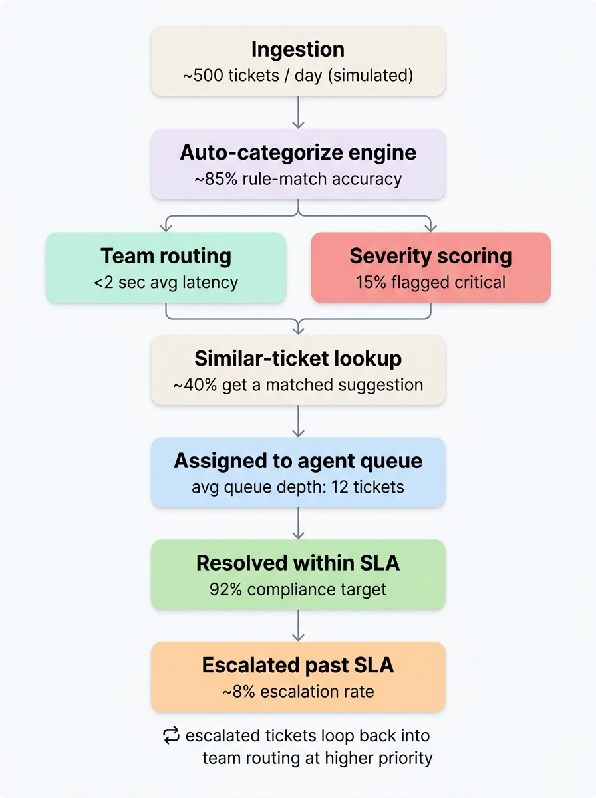

# Support Triage & SLA Escalation Engine

A high-performance ticket classification, automated routing, and real-time SLA loop-back simulation system. Designed to demonstrate an understanding of high-throughput support ticket workflows, queue calibration, and service level agreement (SLA) operations.

🔗 **Live Application:** [https://triagedesk-1.onrender.com](https://triagedesk-1.onrender.com)

---

### 📸 Project Visuals & System Workflow

<div align="center">
  
</div>

---

## 🚀 Key Architectural Features

This project moves beyond standard CRUD mechanics to address the genuine **operational bottlenecks** faced by enterprise engineering and customer experience teams:

1. **Automated Triage & Priority Engines**
   * Dynamically classifies inbound tickets into five distinct engineering departments (**Payments**, **Auth**, **UI**, **Performance**, and **General**) using a deterministic high-performance string matching pipeline.
   * Scores severity based on contextual markers, isolating critical bugs from low-priority styling requests.

2. **Real-Time SLA Countdown & Loop-Back Mechanism**
   * Every incoming ticket receives an immediate Service Level Agreement (SLA) countdown window (ranging from 4 hours for **Critical** to 48 hours for **Low**).
   * **The Loop-Back Loop:** Includes an active loopback trigger. When an active ticket's SLA countdown breaches, the routing engine automatically elevates its severity to **Critical**, re-flags it as **Escalated**, and routes it back into active engineer queues at top priority.

3. **TF-IDF Resolution Similarity Indexer**
   * Uses a fast similarity engine to match incoming reports against a database of past resolved issues.
   * If a match exceeds the threshold, the system immediately pre-populates resolution notes, preventing redundant developer investigation.

---

## 📈 The 6 Operational KPIs We Track

The dashboard includes a dedicated **Ops & KPIs Terminal** running live performance metrics:

| Metric | Business & Operational Value | Implementation in This Project |
| :--- | :--- | :--- |
| **01. Ingestion Volume** | Helps engineering managers align team bandwidth and plan capacity for incoming volumes (~500/day). | A live counter displaying active workspace memory load paired with simulated historical volume charts. |
| **02. Rule-Match Accuracy** | Measures how reliably the deterministic engine routes tickets without requiring manual human re-assignment. | An automated golden-set testing suite that evaluates system routing logic against 20 labeled seed files. |
| **03. Routing Latency** | Tracks how fast an incident goes from ingestion to being assigned to an active team queue. | Live millisecond trackers demonstrating the extreme speed efficiency of string-matching over API-bound layers. |
| **04. Severity Distribution** | Identifies if routing rules are miscalibrated (e.g., if >30% of tickets get flagged as critical, rendering the queues useless). | A dynamic distribution calibrator notifying operations managers if critical incidents breach safe targets. |
| **05. Similarity Hit Rate** | Measures the operational efficiency saved by matching new incidents against historical resolutions. | An active TF-IDF search indexing engine matching incoming bug strings against resolved ticket solutions. |
| **06. SLA Compliance** | The metric support organizations live and die by—tracking resolved incidents completed within target windows. | Computes real-time compliance percentages and provides simulated fast-forward triggers to test queue escalations. |

---

## 🛠️ Technical Stack

* **Frontend:** React 18, Vite, Tailwind CSS, Lucide Icons
* **Backend:** Node.js, Express (Dynamic API routing, performance measurement, in-memory persistence)
* **Language:** TypeScript (Strictly typed interface models for Tickets, Teams, and Severities)

---

## 💻 Getting Started

### 1. Installation
Clone the repository and install all project dependencies:
```bash
npm install
```

### 2. Development Execution
Launch the local Node.js Express server running Vite in middleware mode:
```bash
npm run dev
```
Open [http://localhost:3000](http://localhost:3000) in your browser to interact with the application.

### 3. Production Build
Compile the frontend static bundle and bundle the backend TypeScript server using esbuild:
```bash
npm run build
npm start
```

---

<div align="center">
  <p style="font-family: monospace; font-size: 13px; color: #71717a; letter-spacing: 0.5px;">
    Designed & Engineered with Precision by <strong>Yash Agrawal</strong>
  </p>
</div>
